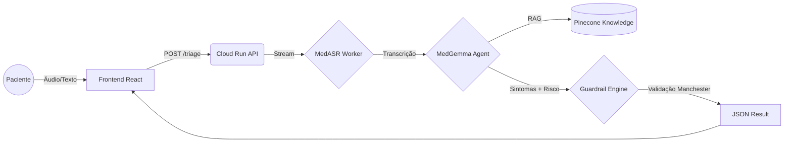

# 🧠 NeuroTriage AI: Agentic Medical Intelligent System


> **State-of-the-Art Medical Triage System** powered by **MedGemma 1.5**, **Deepgram Nova-3 Medical** and **Google Cloud Run**.

[](https://opensource.org/licenses/MIT)
[](https://cloud.google.com/)
[](https://react.dev/)
[](https://www.python.org/)


> [!NOTE]
> **🔴 LIVE DEMO**: [Acessar NeuroTriage v2 (Cloud Run)](https://neurotriage-ai-frontend-10993113678.us-central1.run.app/)

---

## 🚀 Sobre o Projeto - [VEJA UMA DEMONSTRAÇÃO BÁSICA AQUI](https://neurotriage-ai-frontend-10993113678.us-central1.run.app/)

O **NeuroTriage AI** é uma plataforma de triagem médica de alta fidelidade projetada para demonstrar o poder de **Agentes de IA Generativa** em ambientes clínicos críticos. Diferente de chatbots comuns, este sistema implementa uma arquitetura **"Glass Box"**, permitindo total auditabilidade e transparência das decisões da IA.

O sistema processa relatos clínicos via áudio ou texto, transcreve com modelos médicos especializados, extrai sintomatologia usando LLMs afinados (MedGemma) e valida o risco utilizando protocolos de emergência determinísticos (Manchester Protocol).

### ✨ Destaques de Engenharia
*   **Agentic Workflow**: Pipeline orquestrado de IA (ASR -> LLM -> Guardrails).
*   **Glass Box UI**: Frontend React desenhado para expor o "raciocínio" da máquina em tempo real (Logs, JSON Inspector).
*   **Protocolo de Segurança**: Validação determinística para garantir que emergências (ex: IAM) nunca sejam alucinadas ou ignoradas.
*   **Cloud Native**: Arquitetura 100% Serverless no Google Cloud Run (Containerized).

---

## 🛠️ Stack Tecnológico (2025/2026 Standards)

### 🧠 AI & Data Core
*   **LLM de Inferência**: `Google MedGemma 1.5 (27B)` via Vertex AI / HuggingFace.
*   **Speech-to-Text**: `Deepgram Nova-3 Medical` (Latência < 300ms, WER < 2%).
*   **RAG (Retrieval Augmented Generation)**: `Pinecone Serverless` (Busca Híbrida: Vetorial + Keywords).
*   **Guardrails**: Lógica determinística em Python para validação clínica (Protocolo Manchester).

### ☁️ Infraestrutura & Backend
*   **Cloud Provider**: Google Cloud Platform (GCP).
*   **Compute**: Cloud Run (Serverless Containers).
*   **Mensageria**: Google Pub/Sub (para processamento assíncrono de áudio).
*   **Linguagem**: Python 3.11 (Typer, Pydantic, Structlog).

### 💻 Frontend "Glass Box"
*   **Framework**: React 18 + Vite.
*   **Styling**: Tailwind CSS + Shadcn/UI.
*   **Animações**: Framer Motion (60fps fluid transitions).
*   **Conceito**: Engenharia Didática (visualização de steps internos do pipeline).

---

## ⚙️ Arquitetura do Pipeline



---

## 📸 Demonstração ("Inside the Watch")

O frontend foi construído com o conceito **"Inside the Watch"**, permitindo que engenheiros e médicos visualizem os logs de kernel e o fluxo de dados brutos enquanto a IA "pensa".

1.  **Ingestão**: Visualização de buffer de áudio e transcrição.
2.  **Raciocínio**: Exibição do Chain-of-Thought (CoT) do modelo.
3.  **Segurança**: Checklist visual das regras de risco ativadas.

*(Insira GIFs ou Screenshots aqui)*

---

## 🚀 Como Executar Localmente

### Pré-requisitos
*   Python 3.11+
*   Node.js 18+
*   Gcount Account (com Billing ativo)

### Backend
```bash
cd neurotriage-ai
pip install -r requirements.txt
export DEEPGRAM_API_KEY="sua_chave"
python server.py
```

### Frontend
```bash
cd frontend-ui
npm install
npm run dev
```

---

## 👨‍💻 Autor

Desenvolvido por **[Airton Gomes](https://www.linkedin.com/in/airton-gomes-31a943236/)**
*Engenheiro de Software Sênior / AI Specialist*

---

*"Na medicina, a IA não substitui o médico, mas o médico que usa IA substituirá o que não usa."*
